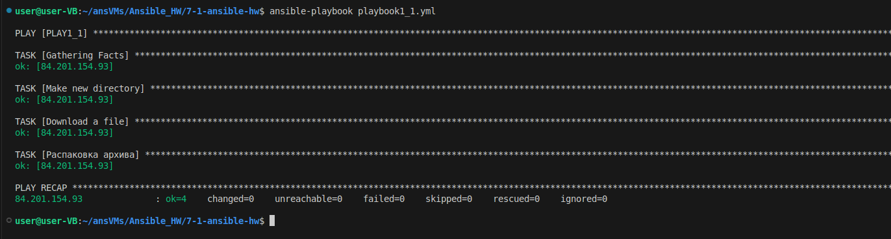

# Домашнее задание к занятию "`Ansible. Часть 2`" - `Чеклин Иван Михайлович`


### Инструкция по выполнению домашнего задания

   1. Сделайте `fork` данного репозитория к себе в Github и переименуйте его по названию или номеру занятия, например, https://github.com/имя-вашего-репозитория/git-hw или  https://github.com/имя-вашего-репозитория/7-1-ansible-hw).
   2. Выполните клонирование данного репозитория к себе на ПК с помощью команды `git clone`.
   3. Выполните домашнее задание и заполните у себя локально этот файл README.md:
      - впишите вверху название занятия и вашу фамилию и имя
      - в каждом задании добавьте решение в требуемом виде (текст/код/скриншоты/ссылка)
      - для корректного добавления скриншотов воспользуйтесь [инструкцией "Как вставить скриншот в шаблон с решением](https://github.com/netology-code/sys-pattern-homework/blob/main/screen-instruction.md)
      - при оформлении используйте возможности языка разметки md (коротко об этом можно посмотреть в [инструкции  по MarkDown](https://github.com/netology-code/sys-pattern-homework/blob/main/md-instruction.md))
   4. После завершения работы над домашним заданием сделайте коммит (`git commit -m "comment"`) и отправьте его на Github (`git push origin`);
   5. Для проверки домашнего задания преподавателем в личном кабинете прикрепите и отправьте ссылку на решение в виде md-файла в вашем Github.
   6. Любые вопросы по выполнению заданий спрашивайте в чате учебной группы и/или в разделе “Вопросы по заданию” в личном кабинете.
   
Желаем успехов в выполнении домашнего задания!
   
### Дополнительные материалы, которые могут быть полезны для выполнения задания

1. [Руководство по оформлению Markdown файлов](https://gist.github.com/Jekins/2bf2d0638163f1294637#Code)

---

### Задание 1

1. Скачать какой-либо архив, создать папку для распаковки и распаковать скаченный архив. Например, можете использовать официальный сайт и зеркало Apache Kafka. При этом можно скачать как исходный код, так и бинарные файлы, запакованные в архив — в нашем задании не принципиально.

Код плейбука:
```YAML
---
- name: PLAY1_1
  hosts: my
  become: yes

  tasks:
   - name: Make new directory
    file:
      path: /home/ivan/apache/
      state: directory

   - name: Download a file
      get_url:
      url: "https://dlcdn.apache.org/kafka/3.9.1/kafka_2.13-3.9.1.tgz"
      dest: "/home/ivan/apache/kafka_2.13-3.9.1.tgz"

   - name: Распаковка архива
      unarchive:
      src: /home/ivan/apache/kafka_2.13-3.9.1.tgz  # Путь к архиву
      dest: /home/ivan/apache/     # Целевая директория
      remote_src: yes                # Распаковывать на удаленном хосте (если архив уже там)
      owner: ivan                    # Владелец распакованных файлов
      group: ivan                   # Группа распакованных файлов
      mode: '0755'                   # Права доступа к распакованным файлам
```
Скрин вывода:




2. Установить пакет tuned из стандартного репозитория вашей ОС. Запустить его, как демон — конфигурационный файл systemd появится автоматически при установке. Добавить tuned в автозагрузку.

Код плейбука:
```YAML
---
- name: PLAY1_2
  hosts: my
  become: yes

  tasks:
  - name: install tuned
    apt:
      name: tuned
      state: present
      update_cache: yes
 
  - name: добавить tuned в автозапуск
    service:
      name: tuned
      enabled: yes
      state: started  # Необязательный параметр, запускает службу, если она не запущена
```
Скрин вывода:


3. Изменить приветствие системы (motd) при входе на любое другое. Пожалуйста, в этом задании используйте переменную для задания приветствия. Переменную можно задавать любым удобным способом.

Код плейбука:
```YAML
---
- name: PLAY1_3
  hosts: my
  become: yes
  vars:
    author: Ivan

  tasks:
  - name: Template a file to /etc/update-motd.d/99-greeting
    template:
      src: ./99-greeting.j2
      dest: /etc/update-motd.d/99-greeting
      owner: root
      group: root
      mode: '0755'
```
Скрин вывода:


---

### Задание 2

1. Модифицируйте плейбук из пункта 3, задания 1. В качестве приветствия он должен установить IP-адрес и hostname управляемого хоста, пожелание хорошего дня системному администратору.

Все изменения были внесены в шаблон файла приветствия. Код плейбука в результате не изменился.
Код файла шаблона:
```bash
#!/bin/bash
echo -e '\033[34m#######################################################
#\033[33m           Greetings for Admin           \033[34m#
#\033[33m      Host IP: {{ ansible_all_ipv4_addresses }}             \033[34m#
#\033[33m         Host hostname: {{ ansible_hostname }}            \033[34m#
#######################################################\033[0m'
```
Скрин вывода:


---

### Задание 3

Ознакомьтесь со статьёй «Ansible - это вам не bash», сделайте соответствующие выводы и не используйте модули shell или command при выполнении задания.

Создайте плейбук, который будет включать в себя одну, созданную вами роль. Роль должна:

    Установить веб-сервер Apache на управляемые хосты.
    Сконфигурировать файл index.html c выводом характеристик каждого компьютера как веб-страницу по умолчанию для Apache. Необходимо включить CPU, RAM, величину первого HDD, IP-адрес. Используйте Ansible facts и jinja2-template. Необходимо реализовать handler: перезапуск Apache только в случае изменения файла конфигурации Apache.
    Открыть порт 80, если необходимо, запустить сервер и добавить его в автозагрузку.
    Сделать проверку доступности веб-сайта (ответ 200, модуль uri).

В качестве решения:

    предоставьте плейбук, использующий роль;
    разместите архив созданной роли у себя на Google диске и приложите ссылку на роль в своём решении;
    предоставьте скриншоты выполнения плейбука;
    предоставьте скриншот браузера, отображающего сконфигурированный index.html в качестве сайта.

1. Код плейбука, использующего роль:

```YAML
---
- name: PLAY2
  hosts: my
  become: yes
  roles:
    - myrole1
```

2. Ссылка на архив с ролью: [Роль](https://drive.google.com/file/d/15Lql3dArr6KCr_2FzRYkcYZt5jypVJdy/view?usp=drive_link)

3. Скрин выполнения плейбука:


4. Скрин браузера с результатом:

